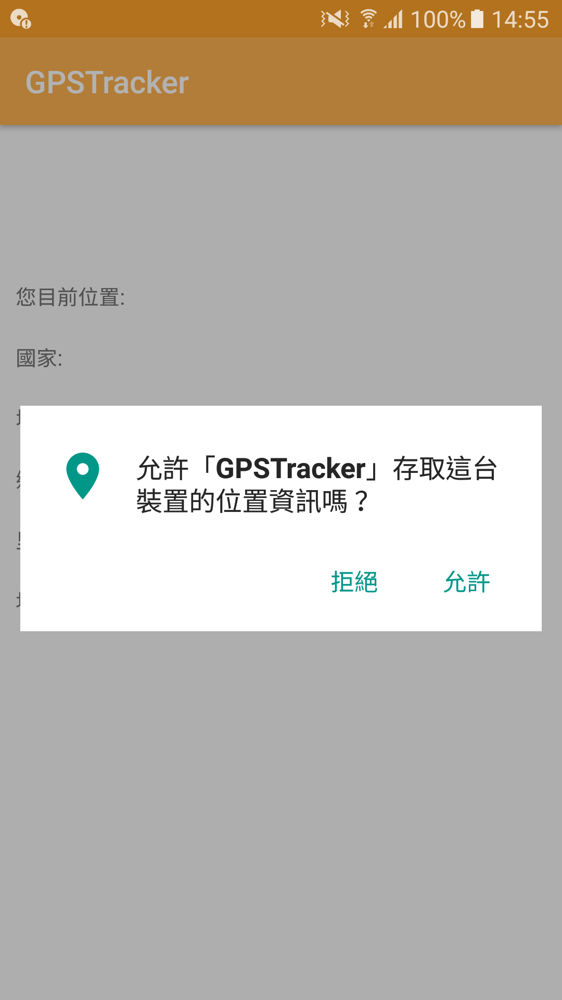
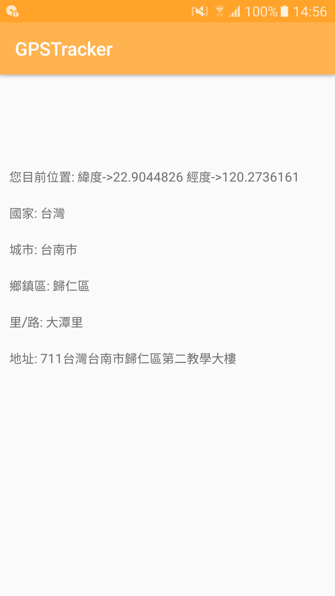

# GpsTracker

## Demo

    

## Introduction

It's GPS tracker extends Service and implements LocationListener

## How to use

* First : add permission in AndroidManifest.xml

```
    <uses-permission android:name="android.permission.ACCESS_FINE_LOCATION" />
    <uses-permission android:name="android.permission.ACCESS_COARSE_LOCATION" />
```

* Second : Add GPSTracker.class

* Third : In Activity you must check premession, so call this function when you start.

```java
private void GPSPremessionCheck() {
        /**偵測權限**/
        if (ActivityCompat.checkSelfPermission(this, Manifest.permission.ACCESS_FINE_LOCATION) != PackageManager.PERMISSION_GRANTED && ActivityCompat.checkSelfPermission(this, Manifest.permission.ACCESS_COARSE_LOCATION) != PackageManager.PERMISSION_GRANTED) {
            //如果沒有授權使用定位就會跳出來這個
            // TODO: Consider calling
            //Log.e("Data6", "進入!");
            //    ActivityCompat#requestPermissions
            // here to request the missing permissions, and then overriding
            //   public void onRequestPermissionsResult(int requestCode, String[] permissions,
            //                                          int[] grantResults)
            // to handle the case where the user grants the permission. See the documentation
            // for ActivityCompat#requestPermissions for more details.
            // 如果裝置版本是6.0（包含）以上
            if (Build.VERSION.SDK_INT >= M) {
                // 取得授權狀態，參數是請求授權的名稱
                int hasPermission = checkSelfPermission(
                        Manifest.permission.ACCESS_FINE_LOCATION);
                // 如果未授權
                if (hasPermission != PackageManager.PERMISSION_GRANTED) {
                    // 請求授權
                    //     第一個參數是請求授權的名稱
                    //     第二個參數是請求代碼
                    //Log.e("Data3", "失敗!");
                    requestPermissions(
                            new String[]{Manifest.permission.ACCESS_FINE_LOCATION},
                            10);
                }
                //Log.e("Data4", "成功!");
            }
        }else{
           showData();
            init_GPS();
        }

    }
```    
* Fourth : Set variable

```java
    private GPSTracker mGps;
    private double mLatitude=0.0,mLongitude=0.0;
    
    mGps = new GPSTracker(this);
    mLatitude = mGps.getLatitude(); //獲取緯度
    mLongitude =mGps.getLongtitude(); //獲取經度
    Log.e("GPS",mLatitude+" "+mLongitude);
```
